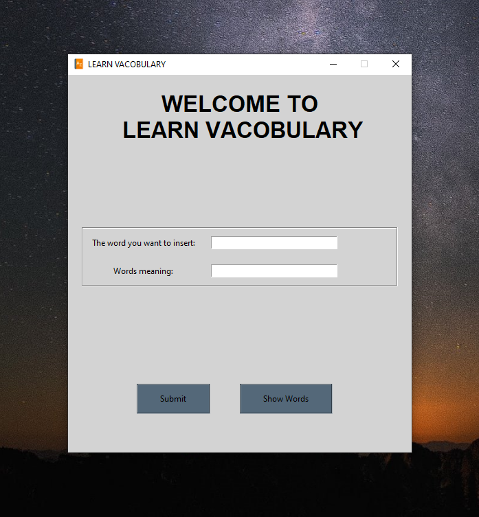
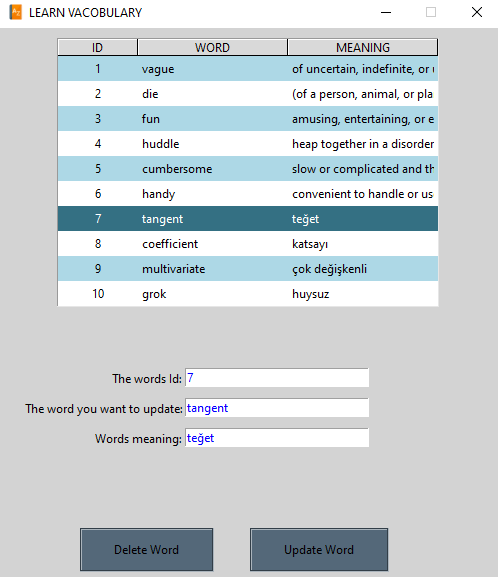
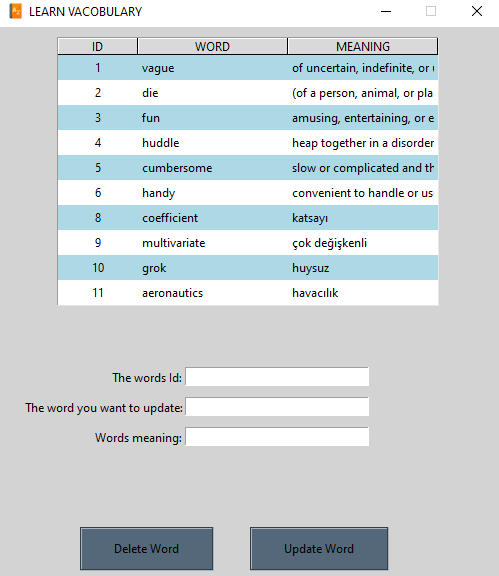

# Python_GUI_Dictionary

Python Tkinter GUI based dictionary example.You may use it as English-English or any Language-Language.

You can make three different actions which are :
- Insert new word
- Delete existing word
- Update the specific word

## Screenshots

|  |  |  |
| --------------- | --------------- | --------------- |
| **Welcome Page and Wordlist** |   ||
|  |  |  |
| **Insert a New Word** |  | |
|  |  |  |
| **Update The Selected Word** |  | | 
|  |  |  |
| **Delete The Selected Word** | | | 

